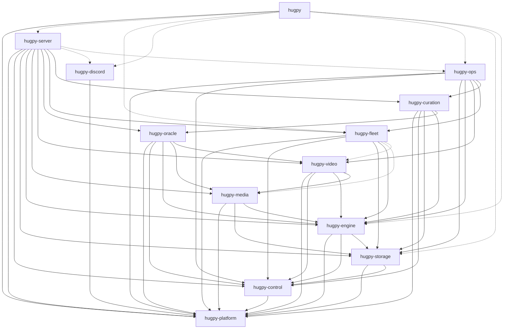

# Hugpy Python ecosystem partition (revision 2)

This is the target decomposition of `abstract_hugpy_dev`. The machine-readable
source ownership map is [`py/partition.toml`](py/partition.toml), validated by
[`py/validate_partition.py`](py/validate_partition.py); the working procedure
for finishing each package is [`py/EXTRACTION_GUIDE.md`](py/EXTRACTION_GUIDE.md)
and the status ledger is [`MOVE_MAP.md`](MOVE_MAP.md).

The split follows runtime ownership rather than the current directory names.
Three current directories are deliberately dismantled:

- `imports/` is a wildcard re-export graph, not a domain. Its contents move to
  the package that owns each contract, registry, constant, or API client.
- `comms/` combines unrelated durable state. Generic control state moves to
  `hugpy-control`; fleet, storage, video, and operations records move with
  their respective domains.
- `flask_app/app/functions/imports/utils/` is not server code. The central
  worker registry, peers, enrollment tokens, pool guard, PID attribution,
  phone-brick store and model groups are fleet-central state; the Hugging Face
  token store is storage; the wire schemas and manifest loader are engine
  catalog contracts; the download helpers are storage; media extraction is
  media. Only API keys, video share keys, Discord bindings, install links and
  format selection stay with the server.

No resulting package may import `abstract_hugpy_dev`. During the transition the
monolith carries a generated relocation finder (`_relocations.py`) so old
dotted paths alias the *same* module objects in the new packages; it is deleted
with the monolith.

## Distribution layout

| Route under `py/` | Distribution | Import package | Ownership |
|---|---|---|---|
| `foundation/hugpy_platform` | `hugpy-platform` | `hugpy_platform` | Env-backed configuration and constants, app dirs, hardware/process/binary probes, client liveness, async bridge, central URL, pydantic compatibility shim, generic helpers |
| `foundation/hugpy_control` | `hugpy-control` | `hugpy_control` | Typed event bus, generic jobs, settings, principals, call log, shared control records, job wire schema |
| `storage/hugpy_storage` | `hugpy-storage` | `hugpy_storage` | Download queue/daemon, HF transport and token, resumable transfer/provision, model sync, physical inventory, metadata and status caches, on-disk model layout, marker/GGUF inspection, console download helpers |
| `inference/hugpy_engine` | `hugpy-engine` | `hugpy_engine` | Prompt-to-reply path, model registry/discovery/classification, allocation, eviction planning, spill, runners, native engines, slots, dispatch, request resolution, task capability map, wire schemas, reconcile/reclassify, placement and task seams |
| `inference/hugpy_media` | `hugpy-media` | `hugpy_media` | Embeddings, summaries, keywords, speech recognition, TTS, vision, vision analysis, image generation, Comfy, document/URL extraction, chunking, model battery; registers as engine task plugins |
| `cinema/hugpy_video` | `hugpy-video` | `hugpy_video` | Media references, media bus, job lifecycle, ffmpeg/synthetic/studio runners, reservations, studio sessions, video schemas, studio assist log; registers video tasks |
| `cinema/hugpy_oracle` | `hugpy-oracle` | `hugpy_oracle` | Creative planning, model selection, screenplay/storyboard, DAG runtime, repair and evaluation, benchmarks, ledgers, performance relay and prompt coordination |
| `fleet/hugpy_fleet` | `hugpy-fleet` | `hugpy_fleet` | Central worker registry and worker HTTP, peers, enrollment, heartbeats, evictions, blocklist, metrics, priority groups and task templates, feeds, doctrine and runbook; full, GGUF and phone workers; placement adapters for the engine |
| `curation/hugpy_curation` | `hugpy-curation` | `hugpy_curation` | Discovery dossiers and the search, screen, download, smoke and judge review pipeline |
| `operations/hugpy_ops` | `hugpy-ops` | `hugpy_ops` | Sentinel, chaos tests, keeper, todo keeper, provisioner (declared-but-missing weights across registries) |
| `integrations/hugpy_discord` | `hugpy-discord` | `hugpy_discord` | Discord client, cogs, streaming adapter and preferences; HTTP client of a Hugpy server |
| `services/hugpy_server` | `hugpy-server` | `hugpy_server` | Flask composition root, routes, auth, SSE, API keys, static mounting of built React applications; installs placement providers and task plugins |
| `meta/hugpy` | `hugpy` | `hugpy` | Thin user CLI (`hugpy`, `hpy`) and install profiles; dispatches to package entry points |

Existing packages remain independent:

| Existing route | Keep because |
|---|---|
| `cinema/abstract_identity` | Owns the complete identity extraction/render service with a clean HTTP boundary. |
| `inference/hugpy_agent` | Portable, dependency-free HTTP client/runtime; must not import server internals. |
| `inference/abstract_claude`, `inference/abstract_gpt` | Station-convention components with their own live/prod/source map; not part of the monolith. |
| `tools/abstract_toolserver` | Owns its database/tool service lifecycle; consumed through its library/service contract. |
| `tools/abstract_apply` | A consumer application built on Hugpy. |
| `tools/hugpy-station` | Host/deployment tooling outside the Python import graph. |

## Dependency direction

Arrows mean "imports." HTTP calls between separately deployed services do not
create Python package dependencies. Dashed arrows are optional (lazy only).

Revision 2 changes against revision 1, all confirmed by the measured import
graph of the monolith:

- **Engine depends on storage and control, not the reverse.** The registry
  reads physical inventory, metadata caches, the job store and settings;
  storage must never read the registry. Storage exposes a `CatalogSource`
  protocol that the engine installs, and publishes `TOPIC_CATALOG_CHANGED` on
  the control bus after transfers. Reconcile and reclassify are catalog
  operations and belong to the engine; provisioning of declared-but-missing
  weights scans three registries and belongs to operations.
- **On-disk model layout is storage.** `constants/paths.py` and
  `hugpy_marker.py` (marker and GGUF header reading) move to storage, and
  `gguf_moe_detail` moves down with them; the engine's spill planner imports
  it from storage.
- **Placement is a seam, not an import.** The engine, video, oracle and
  curation used to import the central worker registry, worker HTTP, eviction
  ledger, blocklist, model metrics and priority groups. They now call
  `hugpy_engine.placement` protocols with single-box null defaults; fleet
  implements them in `hugpy_fleet.central.placement` and the server installs
  them at startup.
- **Task runners are plugins.** The engine's runner/request table becomes
  `hugpy_engine.tasks` (`register_task`, `runner_for_task`,
  `request_builder_for_task`, `load_entry_points`). Media and video register
  through the `hugpy_engine.tasks` entry-point group; the engine imports
  neither.
- **Oracle orchestration leaves video.** `performance_relay.py` and
  `prompt_coordination.py` move to `hugpy_oracle.relay`; video receives
  coordination through a `hugpy_video.hooks` protocol that oracle installs.
- **Feeds, task templates and the task capability map move to their owners.**
  Feeds materialize fleet rosters; task templates name fleet module groups;
  `task_deps.py` is consumed by fleet, oracle and server and lives in engine.
- `comms/__init__.py`, `flask_app/app/functions/imports/**` aggregators and
  all `*.bak-*` files are retired.

## Package contracts

### `hugpy-platform`

The only shared low-level package: stdlib-first plus `abstract_essentials`
and `platformdirs`. It carries no Flask, model, fleet or media concepts and no
domain constants beyond environment-backed configuration values.

### `hugpy-control`

Generic control-plane records and protocols: bus, jobs, settings, principals,
call log, shared records. Stores accept configured roots; no engine, fleet,
server or Flask knowledge. Defines the bus topics other packages publish on.

### `hugpy-storage`

Bytes at rest and in transit. It never decides which runner or worker answers
a prompt and never imports the engine. Its daemon is `hugpy-storage daemon`
(alias `hugpy-downloader`).

### `hugpy-engine`

The former facade becomes the real implementation; `LegacyHugpyBackend` is
deleted. Supports importing and catalog inspection on a CPU-only host, an
in-process GGUF extra, remote/custom backends, and prompt or messages through
streamed events or a completed reply. Hosts the two seams (`placement`,
`tasks`) and installs itself as storage's catalog source.

### `hugpy-media`

Task plugins for the engine. Heavy frameworks are extras imported only inside
the selected runner. `hugpy_media.plugin.register()` populates the engine
registry; `hugpy_media.hooks` lets a worker attach process bookkeeping.

### `hugpy-video` and `hugpy-oracle`

Video owns execution and artifacts; Oracle owns decisions and plans. Oracle
produces immutable specs and submits them through video's public API; video
validates, persists, runs and returns artifacts. Video never imports Oracle.
Identity rendering stays in `abstract-identity` behind its client.

### `hugpy-fleet`

Central and worker implementations stay together so enrollment, heartbeat,
assignment and operation DTOs cannot drift. Separate entry points for the full
worker, slim GGUF worker and phone worker. Media/video capabilities load through
`hugpy_engine.tasks.load_entry_points()` and are optional.

### `hugpy-curation`

Dossiers and review are one lifecycle. Review downloads go through
`hugpy-storage`; dossier data reaches Oracle through `hugpy_oracle.providers`.

### `hugpy-ops`

Sentinel, chaos, keeper, todo keeper and provisioner are leaf consumers of the
public APIs. None of their modules are imported during normal server startup.

### `hugpy-discord`

An HTTP client of a configured Hugpy server with only the Discord optional
dependency; depends on platform alone.

### `hugpy-server`

The only Flask composition root. Routes translate HTTP into public package
APIs; auth, API keys, browser sessions, SSE, response shaping and static
mounting stay here. At startup it installs fleet placement providers, loads
task plugins and wires oracle/video hooks.

### `hugpy`

Thin: friendly command, install profiles, dispatch to package entry points.

## React alignment

| React package and mount | Primary backend owners |
|---|---|
| `@hugpy/ui` at `/` | `hugpy-server`, `hugpy-engine`, `hugpy-storage`, `hugpy-fleet`, `hugpy-control` |
| `@hugpy/agents-ui` at `/fleet` | `hugpy-server` agent routes and standalone `hugpy-agent` nodes |
| `@hugpy/media-intelligence-ui` at `/media` | `hugpy-server` adapters over `hugpy-media` |
| `@hugpy/video-intelligence-ui` at `/video` | `hugpy-server` adapters over `hugpy-video`, `hugpy-oracle`, and `abstract-identity` |
| `@hugpy/ui-shared` | Static shared UI library; no Python package ownership |

## State ownership

| State | Sole owner |
|---|---|
| Model catalog and inference metadata | `hugpy-engine` |
| Download queue, physical inventory, metadata/status caches | `hugpy-storage` |
| Generic jobs, principals and settings | `hugpy-control` |
| Worker enrollment, heartbeat, assignments, evictions, blocklist, metrics, feeds | `hugpy-fleet` |
| Video media library, jobs, reservations and studio sessions | `hugpy-video` |
| Oracle plans, ledgers, scorecards and repair state | `hugpy-oracle` |
| Dossiers, trials and review verdicts | `hugpy-curation` |
| API keys, web sessions and route policy | `hugpy-server` |

No package writes another package's state files directly.

## Rules for every extracted package

Enforced by the generated `tests/test_import_policy.py` in each package:

1. Src layout, one distribution and one import namespace.
2. Explicit imports only; wildcard imports fail the static test.
3. No imports from `abstract_hugpy_dev`.
4. Only the manifest's `depends` may be imported; `optional_depends` only lazily.
5. Base import works with the monolith and every optional dependency blocked.
6. Configuration is injected or loaded through one package-owned config module.
7. Filesystem/database state has one owner and a configurable root.
8. HTTP is an adapter; core behaviour is callable without Flask.
9. Cross-package DTOs live with the owning service; consumers import the public
   contract or use JSON-compatible wire types.
10. Tests move with their implementation and run without the monolith.
11. Every package builds a wheel and passes an installed-wheel import smoke test.
12. The dependency graph stays acyclic; `python py/validate_partition.py` and
    `python py/validate_partition.py --edges` are the gates.
