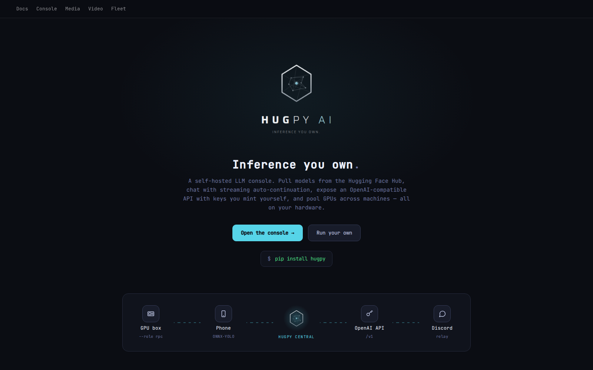
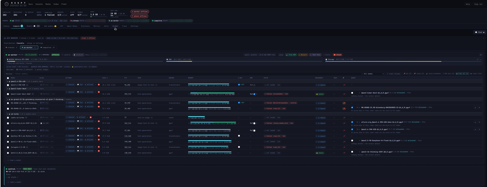
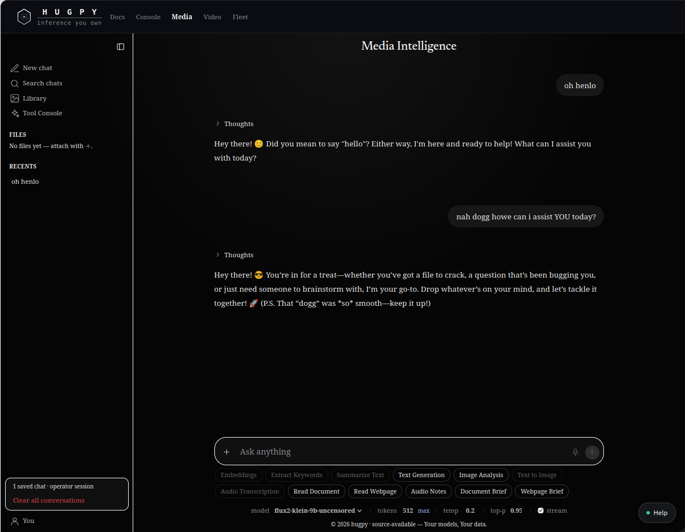
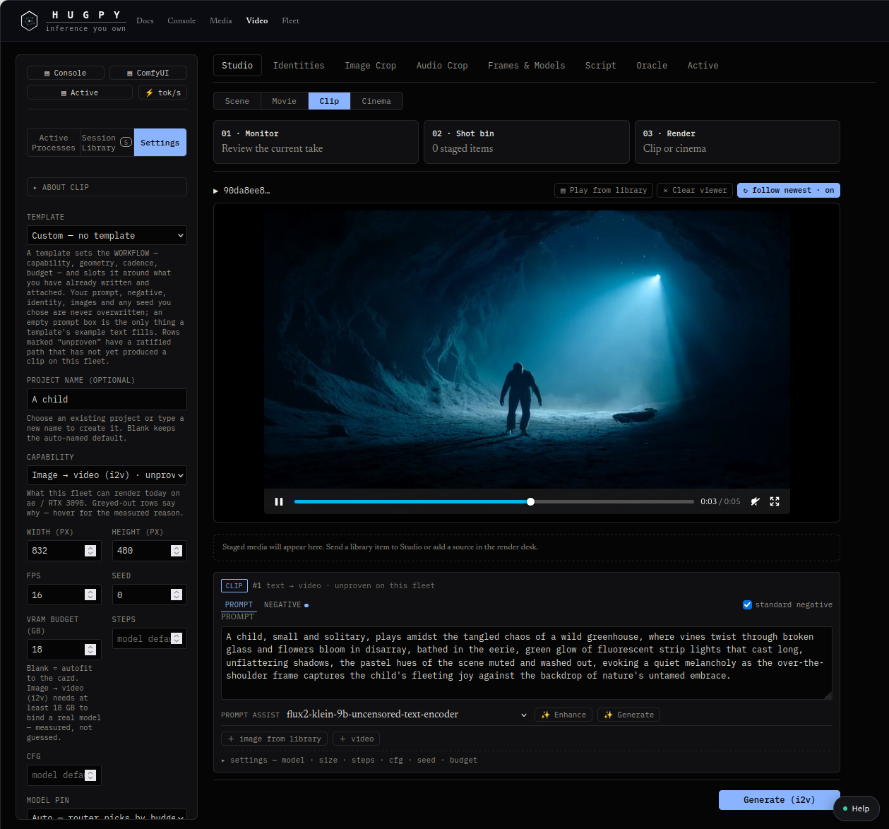
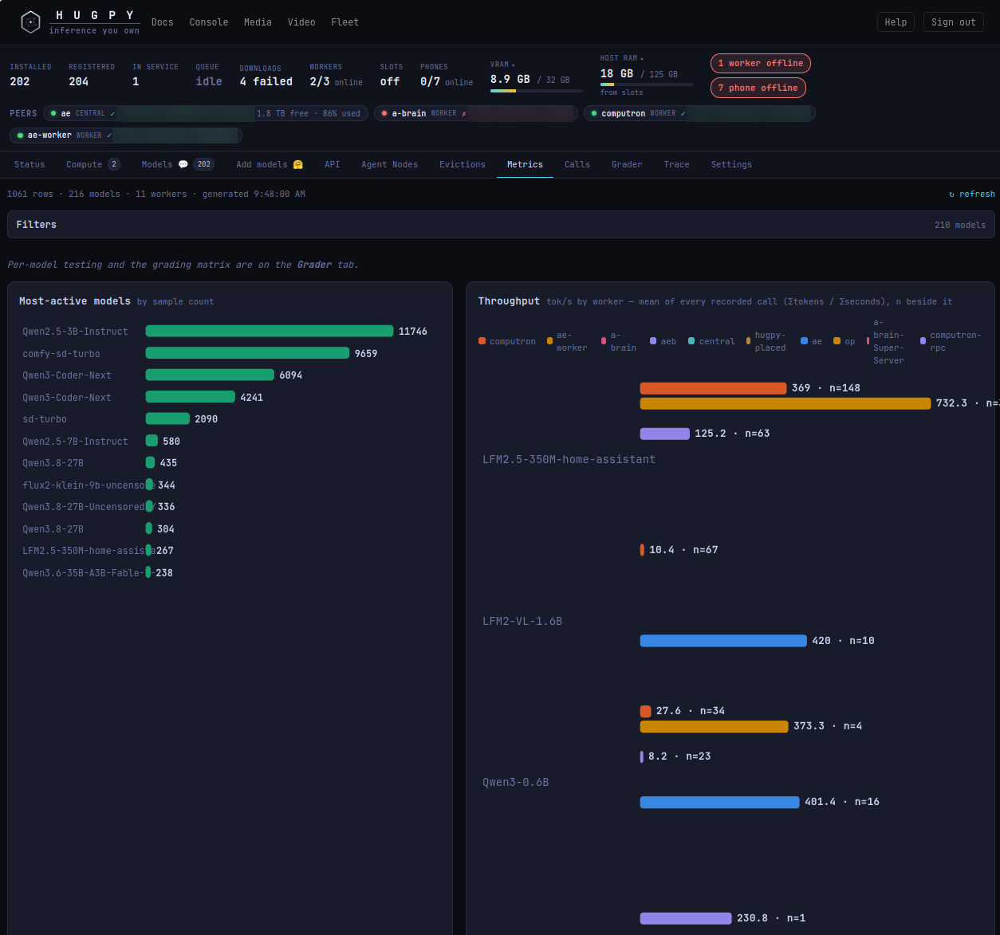
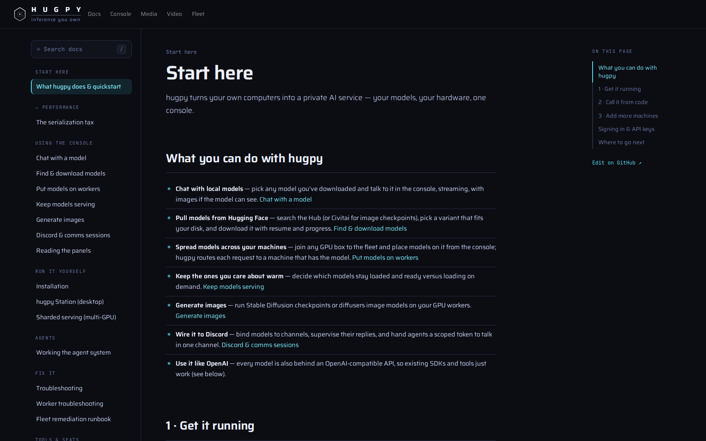
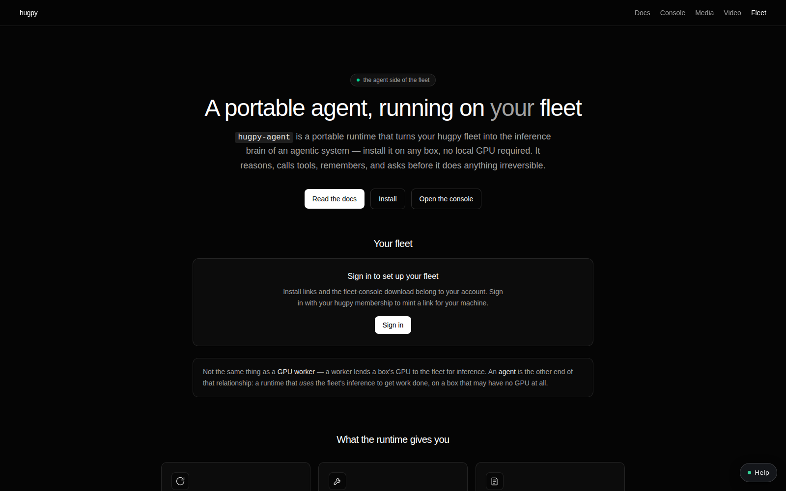

# hugpy — inference you own

Self-hosted LLM console, OpenAI-compatible API and GPU worker fleet. Pull
models from the Hugging Face Hub, chat with streaming continuation, mint your
own API keys, and pool the GPUs you already have (workstations, laptops, boxes
on another network, even phones) into one fleet.

```bash
pip install hugpy
hugpy serve            # console at http://localhost:7002/ , API at /api/v1
```

The base install carries the complete lockstep Hugpy Python module family.
Install a profile such as `hugpy[server]` when this machine also needs its
optional service, native-engine, or GPU dependencies.

From a checkout, `./local_install.sh` installs every package editable into
`.venv` (see [`LOCAL_INSTALL.md`](LOCAL_INSTALL.md)).

## Screenshots



*The landing page: `pip install hugpy`, with central at the hub of GPU boxes, phones, the OpenAI-compatible API and Discord.*



*The Compute tab, one worker's allocation rows: allocation mode, targeted discover, size, context, the GPU and RAM memory bar, 4-bit, MoE, state, residency, pin, and each pair's ranked quant list.*



*Media Intelligence: chat with any served model, plus embeddings, keywords, summaries, image analysis, transcription, and document and webpage briefs.*



*The video studio: image-to-video clips with a VRAM budget, prompt assist from a served model, and the render desk.*



*Metrics: the most-active models and measured throughput per worker, from every recorded call.*



*The built-in docs: start here, using the console, running it yourself, agents and troubleshooting.*



*The Fleet page for `hugpy-agent`, the portable agent runtime that uses the fleet's inference from any box.*

## What's new in 0.2.6

0.2.6 is a ground-up change in where hugpy keeps its state. Every operator
setting now lives in the hugpy database, the console reads and writes that
database directly, and central converges to it. Highlights:

- **The database is the source of truth.** Model designation, per-worker
  allocation knobs, pins, drive inventory and model-wide serving settings are
  rows in PostgreSQL (`HUGPY_REGISTRY_DB=pg`). The old JSON stores for
  assignments, the worker catalog and serve overrides are frozen. Central
  converges to the database in the background, so a restart no longer drops
  unpinned state and the console never waits on central's lock.
- **One row per model and worker.** Each (model, worker) pair carries its own
  context target, KV cache type, flash attention, quant choice, MoE split,
  4-bit load and placement. A pair is either **assigned** (routing may use it)
  or also **pinned** (an operator lock that automation may neither unassign
  nor retune). Every designation records where it came from: operator,
  wildcard, inventory, relay, benchmark or agent.
- **A planner that prices every quant on every worker.** For each weights file
  hugpy stamps the facts once into the model's `hugpy.json`: size, MoE
  structure, per-layer attention and expert bytes, and KV cost per token. The
  planner turns those facts and each worker's budget into a stored verdict per
  quant: which allocation modes fit, the auto mode, the largest context each
  mode can hold for each KV cache type, and the explicit layer band. The
  console shows these verdicts; it no longer guesses.
- **Explicit placement in llama.cpp terms.** The explicit mode sets layer
  counts, not percentages: attention layers on the GPU (`--n-gpu-layers`),
  expert layers kept in RAM (`--n-cpu-moe`), an expert-split toggle for MoE
  models, and a prefer-RAM or prefer-GPU choice for where the leftover band
  goes. Modes that cannot fit are disabled with the verdict's reason.
- **A ranked quant list per pair.** Tick the quants a worker may serve and rank
  them. Rank 1 serves when it fits at the pair's context and KV type; the
  server picks the first listed quant that fits. The lower ranks are the ladder
  for evict-to-fit, so a polite eviction can step down to a smaller quant
  (server-side step-down is the next release).
- **Targeted discovery.** One click on a model's row re-reads that model's
  files: it makes sure the folder has a `hugpy.json`, resyncs the quant list,
  re-stamps the weights facts and recomputes the verdicts on every worker. The
  full **Discover models** pass now ends with the same planner pass over the
  whole store.
- **Split GGUF quants are first-class.** A quant shipped as
  `-00001-of-0000N.gguf` shards is priced from its shard set like any single
  file, so large sharded MoE models get verdicts and explicit placement.
- **Smaller fixes.** Exact MoE pricing with structural KV, worker budgets in
  0.01 GiB steps, a VRAM limit that never exceeds the worker's reported cap, a
  context ceiling that follows the chosen mode and KV type, test-fire filters,
  and Station install links that hand down both the hugpy API key and the
  toolserver key.

## Allocation, the planner and discovery

hugpy decides where and how a model runs from three stored layers, all in the
database:

1. **Weights facts**, once per file. Stamped into the model folder's
   `hugpy.json` and mirrored into the database: size, quant, shard count, MoE
   structure (expert count, expert and non-expert bytes, bytes per layer) and
   the KV cost per token.
2. **Verdicts**, once per quant, per worker, per budget. For every allocation
   mode the planner records whether it fits, the GPU and RAM split, and the
   largest context it can hold for each KV cache type (`f16`, `q8_0`, `q4_0`).
   It also records the auto mode and, for MoE GGUF models, the explicit layer
   band. A verdict is recomputed only when the file or the worker's budget
   changes.
3. **Pair knobs**, set by the operator on the (model, worker) row: context
   target, KV cache type, flash attention, the ranked quant list, MoE split,
   4-bit load, allocation mode and explicit layer counts.

The five allocation modes:

| Mode | Meaning |
|---|---|
| `gpu-only` | The whole model on the GPU |
| `max-gpu` | As many layers on the GPU as fit, the rest in RAM |
| `max-ram` | RAM first, keeping only what helps on the GPU |
| `ram-only` | CPU inference, nothing on the GPU |
| `explicit` | Exact layer counts: attention on the GPU, experts in RAM, and a spill preference |

Auto picks the first mode whose verdict fits and holds the context target.
Clearing an allocation drops only the placement knobs; context, KV cache and
the quant choice stay.

**Discovery** is how hugpy re-reads the disk. **Discover models** walks the
whole store and ends with a change-driven planner pass. **Targeted discovery**
(the per-model button, or `POST /api/models/database/<model>/discover`) does
the same for one model, forced: it guarantees a `hugpy.json`, resyncs the quant
list, re-stamps the facts and recomputes every worker's verdicts.

## What is in this repository

The product is fourteen independently buildable Python distributions plus the
React consoles they serve. Every package has one owner, one import namespace,
and an enforced set of allowed dependencies; the graph is acyclic.

| Directory | Distribution | Role |
|---|---|---|
| `py/foundation/hugpy_platform` | `hugpy-platform` | Configuration, app dirs, hardware/process probes, compatibility shims |
| `py/foundation/hugpy_tools` | `hugpy-tools` | Stdlib-only capability suite for agents: safe file ops, text chunking and diffing, hashing, structured data, webpage assessment |
| `py/foundation/hugpy_control` | `hugpy-control` | Event bus, jobs, settings, principals, call log |
| `py/storage/hugpy_storage` | `hugpy-storage` | Downloads, transfer, physical model inventory, on-disk layout |
| `py/inference/hugpy_engine` | `hugpy-engine` | Model registry and database, the planner, allocation, runners, native engines, dispatch |
| `py/inference/hugpy_media` | `hugpy-media` | Speech, TTS, vision, embeddings, keywords, summaries, image generation |
| `py/cinema/hugpy_video` | `hugpy-video` | Video job bus, runners, studio, reservations |
| `py/cinema/hugpy_oracle` | `hugpy-oracle` | Creative planning, model selection, DAG runtime, evaluation |
| `py/fleet/hugpy_fleet` | `hugpy-fleet` | Central worker registry converging to the database, and the full, GGUF and phone workers |
| `py/curation/hugpy_curation` | `hugpy-curation` | Model discovery dossiers and the review pipeline |
| `py/operations/hugpy_ops` | `hugpy-ops` | Sentinel, chaos, keeper, provisioner |
| `py/integrations/hugpy_discord` | `hugpy-discord` | Discord bot over the HTTP API |
| `py/services/hugpy_server` | `hugpy-server` | Flask composition root, routes, auth, console mounting |
| `py/meta/hugpy` | `hugpy` | The `hugpy` and `hpy` commands and install profiles |
| `react/ui`, `react/agents_ui`, `react/media_intelligence_ui`, `react/video_intelligence_ui`, `react/ui_shared` | `@hugpy/*` | React consoles mounted by `hugpy-server` |
| `react/testshell` | — | Development view of the model database (read-only mirror) |

Related repositories: [hugpy-agent](https://github.com/hugpy/hugpy-agent)
(dependency-free agent runtime), [hugpy-station](https://github.com/hugpy/hugpy-station)
(desktop cockpit), [abstract-identity](https://github.com/hugpy/abstract-identity)
(identity pipeline for video).

## Architecture and contribution

- [`PARTITION.md`](PARTITION.md): package boundaries, dependency direction, state ownership.
- [`py/partition.toml`](py/partition.toml): the machine-readable ownership manifest; `python py/validate_partition.py --edges` is the structural gate.
- [`py/WIRING.md`](py/WIRING.md): what the composition roots install at startup.
- [`py/EXTRACTION_GUIDE.md`](py/EXTRACTION_GUIDE.md): the working rules every package follows.
- [`ECOSYSTEM.md`](ECOSYSTEM.md): registries, naming, versioning and release plan.
- [`CONSISTENCY.md`](CONSISTENCY.md): a release is a git tag; how the one version reaches PyPI, checkouts and the fleet, and the drift check that proves it.
- [`CONTRIBUTING.md`](CONTRIBUTING.md), [`SECURITY.md`](SECURITY.md).

Each package builds and tests on its own:

```bash
cd py/inference/hugpy_engine
python -m build --wheel
pytest -q --timeout=120
```

## License

Source-available; see [`LICENSE`](LICENSE). Commercial licensing at
https://hugpy.ai. Support: support@hugpy.ai.
